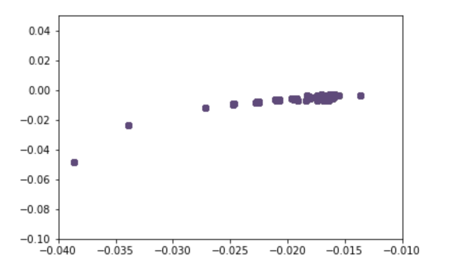
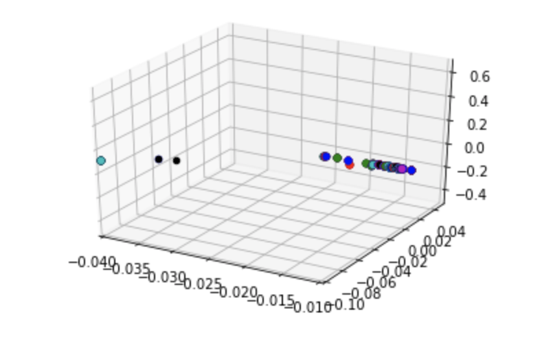

# TextCl

In the following notebook, we try to extract sense from text data using clustering. 

### Data Preprocessing

We first get our data, which is present in the data.txt file. 

we then preprocess it, using our preprocessing function, written in the `utils.py` file. 

pre-processing includes 
- converting it to lower case
- stemming
- removing stopwords


### Converting it into a vector Space

After that, we pass the pre-processed data into our vectorizer, or word2vec model. Here we use NLTKs in built vectorizer function. 

The following converts each word, using context words, into a vector. Thus our entire data, can now be expressed as vectors and has essentially been converted into a vector space.

We attempt to picturise the data, by reducing it's dimnesions into 2 and 3 dimensions and plotting a graph for it.

<p float="left" align="center">
  
  
</p>

Although in the 2D ir 3D form, it may not give an accurate picture of how co-related each word, however, we can roughly assume, that words which are present close to each can be thought as similar.

### Converting it into a vector Space

After that, we pass the pre-processed data into our vectorizer, or word2vec model. Here we use NLTKs in built vectorizer function. 

The following converts each word, using context words, into a vector. Thus our entire data, can now be expressed as vectors and has essentially been converted into a vector space.

We attempt to picturise the data, by reducing it's dimnesions into 2 and 3 dimensions and plotting a graph for it.

Although in the 2D ir 3D form, it may not give an accurate picture of how co-related each word, however, we can roughly assume, that words which are present close to each can be thought as similar.


We then pick the top words, associated with each centroid. 

Thus since we know the cenroids are places, which we have a greater number of words, picking up the top words associated with a centroid, indirectly gives us an important `topic` of the document.

Such as the ones displayed below.


### Clusters


```
Cluster 0: time phone t mrs like attention house
Cluster 1: apps years honest experience experiment facebook feel
Cluster 2: s trump people years going easy email
Cluster 3: iphone years grateful email experience experiment facebook
Cluster 4: delete years grateful experience experiment facebook feel
```
### Development and Testing

In order to use the following repository

```bash
# Clone this repository
git clone https://github.com/sahitpj/TextCl.git

# Go into the repository
cd TextCl

# Install dependencies
pip install -r requirements.txt

# Run the notebook
jupyter notebook

#then open demo
```